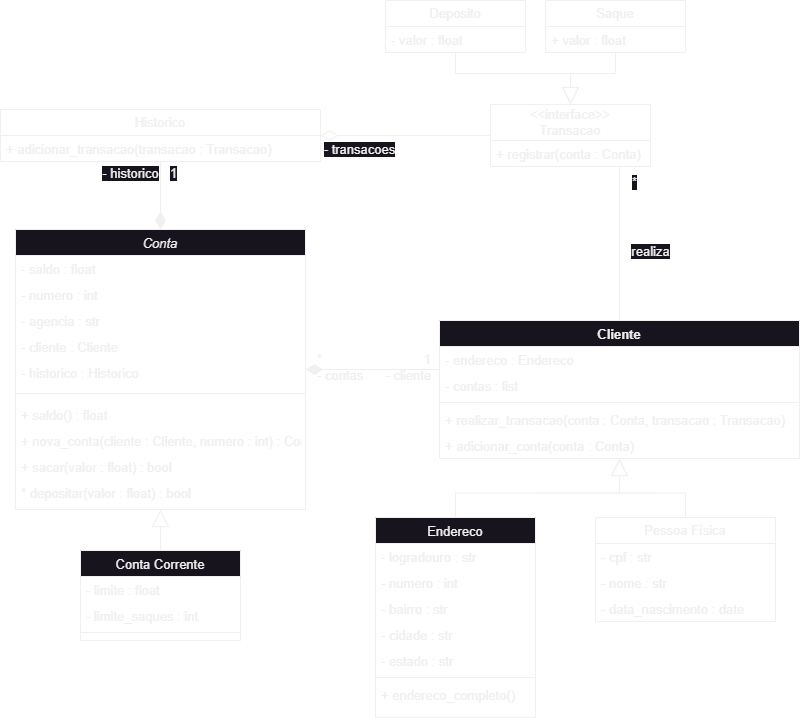

# dio-sistema-bancario
Sitema bancário para entrega do projeto de desafio

# DESAFIO 01
## Escopo
Criar um sistema bancário com as operações: sacar, depositar e visualizar extrato
##
### Operação Depósito:
Deve ser possível depositar valores positivos para conta bancária. A v1 do projeto deve trabalhar apenas com 1 usuário,
dessa forma não é necessário se preocupar com identificação do número da agência e conta bancária. Todos os depósitos
devem ser armazenados em uma variável e exibidos na operação de extrato.
### Operação de Saque:
O sistema deve permitir realizar 3 saques diários com limite máximo de R$500,00 por saque. Caso o usuário não tenha
 saldo em conta, o sistema deve exibir uma mensagem informando que não será possível sacar o dinheiro por falta de
 saldo. Todos os sques devem ser armazenados em uma variável e exibidos na operação de extrato.
### Operação de extrato
Essa operação deve listar todos os depósitos e saques realizados na conta. No fim da listagem deve ser exibido o saldo
atual da conta.
Os valores devem ser exibidos utilizando o formato R$ XXX.XX, exemplo:
1500.45 = R$ 1500.45

### Diário de Usuário
O sistema pede para que seja selecionada uma das opções em tela
Aloke seleciona a opção de [d] Depósito, o sistema abre a tela de deposito
Aloke digita o valor a ser depositado e o sitema valida se é um valor positivo
Caso seja um valor negativo uma mensagem aparece na tela
o sistema registra o tipo de operação, a data da operação e o valor
Aloke seleciona a opção de [s] Saque, o sistema abre a tela de saque
Na tela de saque é exibido o valor disponível em conta e a quantiade de saques ainda restantes
Aloke digita o valor a ser sacado, caso a quantidade de saques ou o valor a ser sacado seja maior
que o disponível em conta, será exibida uma mensagem. Se estiver tudo certo será exibido o valor
sacado e registrada o tipo de operação, a data da operação e o valor
Aloke digita a opção de extrato para validar o que tem em conta
O Sistema abre a tela de extrato e exibe todas as operações executadas e sua respectiva data
Ao final do extrato é exibido o valor do saldo atual da conta 
Valores devem ser exibidos como R$ XXX.XX

########################################################################################################################
# DESAFIO 02
## Objetivo Geral
Separar as funções existentes de saque, depósito e extrato em funções. Criar duas novas funções: cadastrar usuário 
(cliente) e cadastrar conta bancária.

## Desafio
Precisamos deixar nosso código mais modularizado, para isso vamos criar funções para as operações existentes:
sacar, depositar e visualizar histórico. Além disso, para a versão 2 do nosso sistema precisamos criar duas novas
funções: criar usuário (cliente do banco) e criar conta corrente (vincular com usuário).

### Saque
A função saque deve receber os argumentos apenas por nome (keyword only). Sugestão de argumentos: saldo, valor, extrato,
limite, numero_saques, limite_saques. Sugestão retorno: saldo e extrato.

### Depósito
A função depósito deve receber os argumentos apenas por posição (positional only). Sugestão de argumentos: saldo, valor,
extrato. Sugestão de retorno: saldo e extrato.

### Extrato
A função extrato deve receber os argumentos por posição e nome (positional only e keyword only). Argumentos posicionais:
saldo, argumentos nomeados: extrato.

## Novas funções
Precisamos criar duas funções: criar usuário e criar conta corrente. Fique a vontade para adicionar mais funções,
exemplo: listar contas.

### Criar usuário (cliente)
O programa deve armazenar os usuários em uma lista, um usuário é composto por: nome, data de nascimento, cpf e endereço.
O endereço é uma string com o formato: logradouro, nro - bairro - cidade/sigla estado. Deve ser armazenado somente os 
números do CPF. Não podemos cadastrar 2 usuários com o mesmo CPF.

### Criar conta corrente
O programa deve armazenar contas em uma lista, uma conta é composta por: agência, número da conta e usuário. O número
da conta é sequencial, iniciando em 1. O número da agência é fixo: "001". O usuário pode ter mais de uma conta, mas uma
conta pertence a somente um usuário.

### Dica
Para vincular um usuário a uma conta, filtre a lista de usuários buscando o número do CPF informado para cada usuário da
lista.

########################################################################################################################
# DESAFIO 03
## Objetivo Geral
Iniciar a modelagem do sistema bancário em POO. Adicionar classes para cliente e as operações bancárias:
depósito e saque.

## Desafio
Atualizar a implementação do sistema bancário, para armazenar os dados de clientes e contas bancárias em objetos ao
invés de dicionários. O código deve seguir o modelo de classe UML a seguir:

### Classe Conta:
* Atributos: saldo, numero, agencia, cliente, historico
* Métodos: saldo, nova_conta, sacar, depositar

### Classe ContaCorrente
* extende de Conta
* Todos os atributos + dois: limite, limite_saques

### Historico
* Historico pertence a conta
* argumento: transacoes
* Método: adicionar_transacao

### <<Intergace>> Transacao
* Método: registrar

### Deposito e Saque
* Implemetam da classe abstrata Transacao

### Cliente
* atributos: endereco e contas
* métodos: realizar_transacao e adicionar_conta

### PessoaFisicaa
* Tipo de Cliente

## Desafio Extra
Após concluir a modelagem das classes e a criação dos métodos. Atualizar os métodos que tratam as opções do menu, para
funcionarem com as classes modeladas.

########################################################################################################################
# DESAFIO 04

## Introdução
Com os novos conhecimentos adquiridos sobre decoradores, geradores e iteradores, você foi encarregado de implementar
as seguintes funcionalidades no sistema:
* Decorador de log
* Gerador de relatórios
* Iterador personalizado

### Decorador de log
Implemente um decorador que seja aplicado a todas as funções de transações (depósito, saque, criação de conta, etc).
Esse decorador deve registrar (printar) a data e hora de cada transação, bem como o tipo de transação.

### Gerador de relatórios
Crie um gerador que permita iterar sobre as transações de uma conta e retorne, uma a uma, as transações que foram
realizadas. Esse gerador deve também ter uma forma de filtrar as transações baseado em seu tipo (por exemplo, apenas
saques ou apenas depósitos).

### Iterador personalizado
Implemente um iterador personalizado Contalterador que permita iterar sobre todas as contas do banco, retornando
informações básicas de cada conta (número, saldo atual, etc)

########################################################################################################################
# DESAFIO 05

## Introdução
Com os novos conhecimentos adquiridos sobre data e hora, você foi encarregado de implementar as seguintes 
funcionalidades no sistema:
* Estabelecer um limite de 10 transações diárias para uma conta
* Se o usuário tentar fazer uma transação após atingir o limite, deve ser informado que ele excedeu o número de
transações permitidas para aquele dia
* Mostre no extrato, a data e hora de todas as transações

########################################################################################################################
# DESAFIO 06

## Introdução
Em nossa aplicação financeira, identificamos a necessidade de rastrear e auditar as ações dos usuários para garantir a
segurança e integridade das operações. O console tem sido útil até agora, mas a quantidade crescente de atividades torna
difícil acompanhar todas as operações em tempo real.
Portanto, decidimos que é vital registrar essas informações em um arquivo para análise posterior e backup contínuo.

## Objetivo
Modificar o atual decorador de log, que imprime informações no console, para que ele salve essas informações em um
arquivo de log, possibilitando uma revisão mais fácil e uma análise mais detalhada das operações dos usuários.

## Requisitos
O decorador deve registrar o seguinte para cada chamada de funções:
1. Data e hora atuais. (Dia/Mês/Ano)
2. Nome da função.
3. Argumentos da função.
4. Valor retornado pela função.
5. O arquivo de log deve ser chamado log.txt.
6. Se o arquivo log.txt já existir, os novos logs devem ser adicionados ao final do arquivo.
7. Cada entrada de log deve estar em uma nova linha.